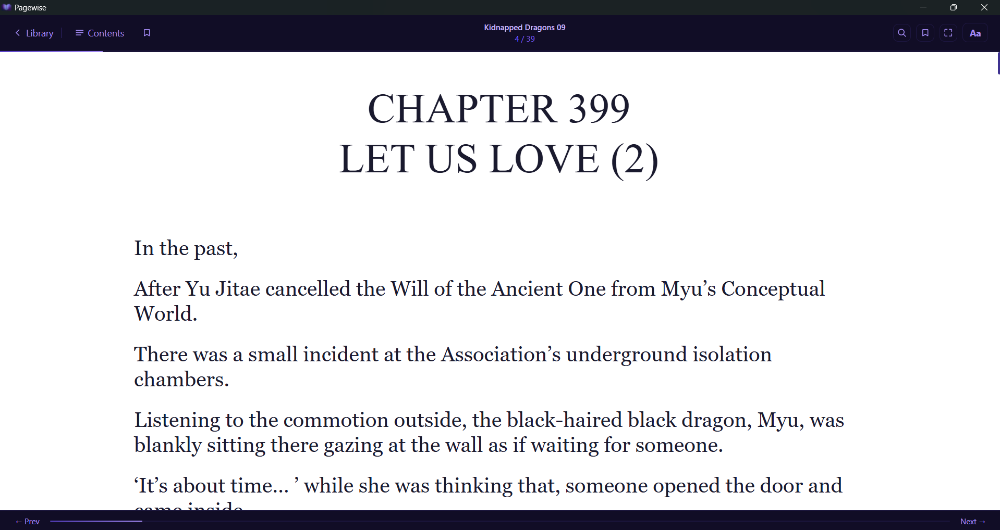

<div align="center">
  
  <h1>Pagewise</h1>
  <p>A clean, fast EPUB and PDF reader for Windows built with Tauri and React.</p>

  
  
  
</div>

---

## Screenshots

<div align="center">
  
  <p><em>Library view with cover grid, search, sort, and shelves sidebar</em></p>

  <br/>

  
  <p><em>Reader with chapter navigation, progress bar, and toolbar</em></p>
</div>

---

## Features

**Library**
- Import EPUB and PDF files via file picker, folder picker, or drag-and-drop
- Drag-and-drop handles both files and folders (recursively scanned)
- Concurrent import with per-file error reporting and a live progress toast
- Duplicate detection before any file I/O
- Covers stored as JPEG files on disk, not base64 in localStorage, keeping the app fast with large libraries
- Automatic cover, title, and author extraction from file metadata
- Metadata editor to fix title, author, or cover after import
- Shelves for organizing books, auto-created from import folder names
- Filter by file type (All / EPUB / PDF)
- Search by title or author, sort by recently added, title, author, or progress
- Multi-select mode for bulk removal
- Reading statistics: total time, chapters read, books completed

**EPUB Reader**
- Renders chapter HTML directly, no WebView2 iframe sandboxing issues
- Preserves original EPUB formatting and stylesheets
- Inline images including SVG cover pages
- Table of contents panel for direct chapter navigation
- Bookmarks with TOC-aware labels
- In-book text search (Ctrl+F) with match highlighting and cycling
- Scroll position saved and restored within each chapter

**PDF Reader**
- Page-by-page canvas rendering via pdf.js
- Fit-width scaling, auto-adjusts on window resize
- Jump to page overlay (click the page counter)

**Both Readers**
- Keyboard and click-zone navigation (arrow keys, click left/right edge)
- Focus mode for distraction-free reading (F to toggle, Esc to exit)
- Progress bar and position counter
- Reading time tracking per session

**Customization (EPUB)**
- Font family and font size
- Line spacing
- Reading column width (Narrow / Medium / Wide / Full)
- Light, dark, and sepia themes

**Reliability**
- Corrupt, DRM-locked, or missing files show a clear error instead of hanging
- One bad file in a batch drop does not block the rest
- Author metadata sanitization handles placeholder junk from scanlation EPUBs
- Error boundary catches unexpected render crashes and shows a recovery screen

---

## Tech Stack

| Layer | Technology |
|---|---|
| Desktop shell | [Tauri](https://tauri.app/) (Rust) |
| Frontend | React + TypeScript |
| EPUB parsing | [epub.js](https://github.com/futurepress/epub.js/) |
| PDF rendering | [pdf.js](https://mozilla.github.io/pdf.js/) (pdfjs-dist) |
| State | [Zustand](https://github.com/pmndrs/zustand) |
| Styling | [Tailwind CSS](https://tailwindcss.com/) |
| Build | [Vite](https://vitejs.dev/) |

---

## Getting Started

### Prerequisites

- [Node.js](https://nodejs.org/) 18 or later
- [Rust](https://rustup.rs/) (stable toolchain)
- [Tauri prerequisites for Windows](https://tauri.app/v1/guides/getting-started/prerequisites#windows): Microsoft C++ Build Tools and WebView2

### Run in development

```bash
git clone https://github.com/YOUR_USERNAME/pagewise.git
cd pagewise
npm install
npm run tauri dev
```

The first build takes a few minutes while Cargo downloads and compiles dependencies. Subsequent runs are fast.

### Build a release installer

```bash
npm run tauri build
```

The installer and standalone executable will be in `src-tauri/target/release/bundle/`.

---

## Project Structure

```
pagewise/
├── src-tauri/          # Rust backend (Tauri config, icons, main.rs)
├── screenshots/        # README screenshots
└── src/
    ├── components/
    │   ├── Library/    # LibraryView, BookCard, Sidebar, MetadataEditor, StatsPanel
    │   ├── Reader/     # ReaderView, PdfReaderView, TocPanel, BookmarksPanel, SearchBar
    │   └── Settings/   # SettingsPanel
    ├── hooks/          # useBookImport, useFileDrop, useClickOutside
    ├── store/          # Zustand stores (library, settings)
    ├── types/          # Shared TypeScript types
    └── utils/          # coverStorage, text sanitization
```

---

## Known Limitations

- **epub.js iframe renderer is bypassed.** Tauri's WebView2 blocks scripts inside epub.js's iframe. Pagewise extracts each chapter's raw HTML and injects it directly into the DOM instead. Some advanced EPUB layouts may render differently than in a browser-based reader.
- **No DRM support.** EPUB or PDF files protected by DRM will fail to open.
- **macOS / Linux not tested.** The codebase is cross-platform in principle but has only been developed and tested on Windows.

---

## License

MIT -- see [LICENSE](LICENSE) for details.
